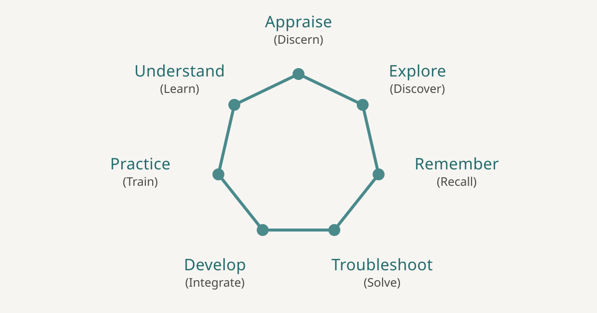

# Seven-Action Documentation Model

[7act.org](https://7act.org/) is a multilingual guide to the Seven-Action Documentation Model: a way to plan and evaluate documentation by asking what readers are trying to accomplish.



Documentation frameworks often begin with what writers should produce—a tutorial, a how-to guide, an explanation, or a reference page. The Seven-Action Model begins one step earlier: **why has the reader come to the documentation?**

It describes seven common actions:

- **Appraise** — decide whether a product or approach is a good fit.
- **Understand** — grasp its concepts, abstractions, and mental models.
- **Explore** — try it out and discover what it can do.
- **Practice** — learn how to use it in everyday situations.
- **Remember** — look up details that are difficult or unnecessary to memorize.
- **Develop** — integrate, extend, or build upon it.
- **Troubleshoot** — diagnose a problem and find a way forward.

The seven actions are neither a checklist nor seven prescribed content types. One document may support several actions, and the same kind of content may serve different needs. The model helps teams identify those needs before deciding what to write, how to organize it, and how to tell whether it works.

## Where the model came from

Fabrizio Ferri Benedetti first proposed the model in [“The Seven-Action Documentation model”](https://passo.uno/seven-action-model/), published on passo.uno on 9 January 2025.

The original essay argues that documentation should be treated as a product people use to achieve real goals. It introduces the seven actions, explains how they relate to a reader's journey, and shows how they can complement—not replace—frameworks such as Diátaxis and DITA.

This repository grew from that essay. The website expands it into a browsable reference where each action has its own rationale, reader signals, possible content types, examples, measures, and relationships to the rest of the model.

## What you can do with the site

Use [7act.org](https://7act.org/) to:

- plan a new documentation set around reader needs;
- spot gaps in existing documentation;
- discuss content priorities with writers, designers, engineers, and product teams;
- choose useful measures for different documentation goals; and
- share a common vocabulary across a team.

The guide is available in English, Spanish, French, Italian, Portuguese, German, Japanese, Simplified Chinese, Arabic, and Persian. The Arabic and Persian editions use right-to-left layouts.

## Download the agent skill

The repository also includes a skill that lets Claude apply the model while planning, writing, auditing, or restructuring documentation. Install it with the [Vercel Skills CLI](https://skills.sh/):

```bash
npx skills add theletterf/sevenactionmodel \
  --skill seven-action-documentation \
  --agent claude-code
```

Once installed, Claude can recognize when the model is relevant or you can ask it explicitly to use the Seven-Action Documentation Model.

## Contributing

Corrections, better examples, translation improvements, and thoughtful refinements are welcome. Because every edition describes the same model, translated changes should preserve the meaning and level of detail of the English source.

If you want to preview a change locally, install Hugo Extended and run:

```bash
hugo server
```

Most of the site's written content lives in `data/<language>/model.yaml`.

## License

The model and site content are licensed under [Creative Commons Attribution 4.0 International](https://creativecommons.org/licenses/by/4.0/). The code used to build the site is licensed under the [MIT License](LICENSE).
